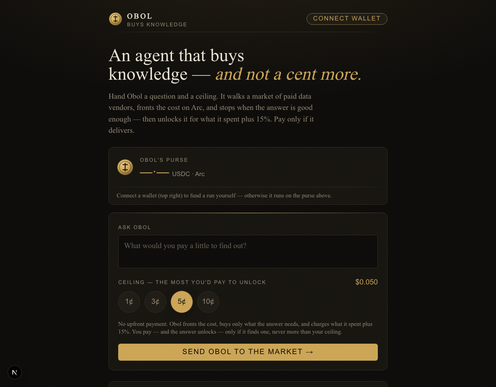

# Obol

**Agentic commerce on Arc: an autonomous agent that buys data, sells answers, and settles every sub-cent payment in USDC.**

[](https://www.typescriptlang.org/)
[](https://nextjs.org/)
[](https://www.circle.com/nanopayments)
[](https://www.circle.com/)
[](LICENSE)
[]()



Obol is a machine participant in a market. Give it a question and a ceiling
(the most you'd pay), and it walks a live market of priced data vendors,
reasons about which sources are worth paying for, and pays each per call via
**Circle Nanopayments** on **Arc**: gasless, sub-cent, settled instantly.
Then it sells you the synthesized answer for **what it spent plus 15%**.

It buys wholesale, sells retail, and earns the spread: an agent that **makes a
market in knowledge**. You front nothing; Obol fronts the cost and only
charges if it delivers, never above your ceiling. No pre-funded budget, no
overpayment, no refunds to chase.

An *obol* was the small coin an Athenian carried into the agora for the day's
small purchases. Obol is an agent that walks that agora with a purse, and
spends deliberately.

> Built for the **Agora Agents Hackathon** (Canteen × Circle × Arc).

**Highlights**
- **Agentic commerce, live on Arc.** Every call is a real Circle Nanopayment (Gateway batching), the primitive Circle built for high-frequency machine-to-machine commerce. Gasless, sub-cent, verified end-to-end.
- **A two-sided market agent.** Obol fronts capital to buy data wholesale and sells answers at cost + 15%, earning the spread. A business, not a faucet.
- **Genuine procurement intelligence.** Discovers a 7-vendor market (incl. SEC EDGAR filings, OpenAlex citations, Tavily web research), corroborates across sources under budget, and stops when the answer holds. Real decisions, not automation.
- **Honest by construction.** Never charged for a failed or empty result, spend-guarded against draining its purse, and settles every transaction in USDC on Arc.

---

## How it works

```
            ┌──────────────────────────────────────────────┐
            │  Frontend (Next.js)                          │
            │  question + ceiling → live work view + unlock│
            └───────────────┬──────────────────────────────┘
                            │ spawns
            ┌───────────────▼──────────────────────────────┐
            │  Agent core  (Claude tool-use loop)          │
            │  budget policy · vendor choice · stop signal │
            └───────┬───────────────────────┬──────────────┘
            MCP stdio │                       │ MCP stdio
        ┌─────────────▼────────┐   ┌──────────▼─────────────┐
        │  Payments MCP server │   │  Ledger MCP server     │
        │  x402 discovery      │   │  records every payment │
        │  Circle Gateway pay  │   │  builds the receipt    │
        └─────────┬────────────┘   └────────────────────────┘
                  │ x402 over HTTP
        ┌─────────▼────────────┐   ┌────────────────────────┐
        │  Data market (HTTP)  │   │  Circle Gateway        │
        │  7 paywalled vendors │──▶│  batches → settles Arc │
        └──────────────────────┘   └────────────────────────┘
```

- **Agent core** (`agent/`) is a Claude-powered loop. Its persona and spending
  rules live in `agent/CLAUDE.md`; `budget.ts` and `decide.ts` are the hard
  rails (a budget that cannot be breached, caps that guarantee termination).
  Choosing *which* vendor and *when to stop* is the model's own reasoning.
- **Payments MCP server** (`mcp/payments/`) does x402 service discovery and
  Circle Nanopayments. Obol pays each vendor through the Circle Gateway client
  (`@circle-fin/x402-batching`), which signs an off-chain authorization and
  draws from Obol's Gateway balance.
- **Data market** (`mcp/data/`) hosts seven x402-paywalled vendors framed as
  metered research services: Entity Brief (Wikipedia), Market Data Terminal
  (CoinGecko), Location Intelligence (Open-Meteo), Signal Feed (HN Algolia),
  Deep Research (Tavily web search), Scholar Index (OpenAlex), and Filings Desk
  (SEC EDGAR). Each is the kind of source a desk would otherwise subscribe to;
  Obol pays per call instead. Deep Research and Scholar Index are priced just
  apart on purpose, so the agent has to *decide* when peer-reviewed evidence is
  worth the upcharge.
- **Ledger MCP server** (`mcp/ledger/`) records every micropayment and decision
  into a local SQLite index used to render the work view fast. The settlement
  on Arc is the canonical record.
- **Circle Gateway** verifies each off-chain authorization instantly and
  batches many of them into a single on-chain settlement on Arc, so payments
  are gasless and sub-cent. Obol runs no facilitator and holds no relayer key;
  the data market verifies and settles through `BatchFacilitatorClient`.

## Circle / Arc stack

| Primitive | Where Obol uses it |
|---|---|
| **Circle Nanopayments / Gateway** | `@circle-fin/x402-batching`. Obol signs off-chain authorizations that Circle Gateway verifies instantly and settles in batches. Gasless, sub-cent, no self-hosted facilitator. |
| **x402** | The discovery and 402 payment handshake between Obol and the data market. |
| **Arc testnet** | Settlement layer (chain `5042002`, `eip155:5042002`), USDC-denominated gas. Every batch confirms here. |
| **Gateway Wallet** | Obol deposits USDC into the Gateway Wallet (`0x0077…19B9`); each payment draws from that balance. |

## Setup

See **[SETUP.md](SETUP.md)** for the full walkthrough. In short:

```bash
npm install
cp .env.example .env          # then add your Arc RPC + USDC addresses
npm run wallet:create         # generates Obol's wallet into .env (git-ignored)
# fund the printed address at https://faucet.circle.com
npm run gateway:deposit --workspace=@obol/payments -- 3.00   # deposit into Circle Gateway
npm run wallet:status         # confirm the balances landed
```

## Running

```bash
npm run start --workspace=@obol/data   # x402 data market   :4020
npm run dev                            # frontend            :3000
```

Open http://localhost:3000, ask a question, set a ceiling, and watch Obol shop.
There is no facilitator to run: Circle Gateway settles.

Or run it headless:

```bash
npm run agent -- --question "What is the price of Ethereum right now?" --budget 0.05
```

## How you pay (pay-to-unlock)

Obol works first and bills after, so you never overpay:

1. You set a **ceiling**, the most you'd pay. No money moves yet.
2. Obol **fronts the cost** from its own Gateway balance, buying only what the
   answer needs (capped so the final price stays under your ceiling).
3. When it's done, Obol shows the **receipt** (every vendor it paid and what it
   spent) and **locks the answer**. The price to unlock is **what it spent plus
   15%** (Obol's margin for the work).
4. You sign **one** USDC payment to Obol; the answer unlocks once it confirms on
   Arc. Find nothing, pay nothing.

This makes Obol a small autonomous business: it fronts capital, does
procurement, and earns a margin on delivery.

> **v2: escrow.** A production version would lock the ceiling in an on-chain
> escrow that releases Obol's cost-plus-margin and refunds the remainder
> automatically. We chose pay-to-unlock for the demo because it needs no
> contract and avoids a spend-authorization oracle: the user consents to the
> exact price at unlock, after seeing the receipt. Escrow becomes compelling
> once per-run spend is provable on-chain (today Gateway batches settlement, so
> it isn't cleanly verifiable at release time).

## Verifying the spend

Obol pays through **Circle Nanopayments**: each call is an off-chain USDC
authorization that Circle Gateway verifies instantly and settles on Arc in
batches. What's on-chain and verifiable:

- **The funding deposit.** Obol's USDC deposit into the Gateway Wallet is a real
  Arc transaction on `testnet.arcscan.app`.
- **The batched settlements.** Circle Gateway settles authorizations on Arc
  against the Gateway Wallet contract (`0x0077777d7EBA4688BDeF3E311b846F25870A19B9`),
  and those settlements land at the vendor payout address.

Per payment, the receipt shows each call's **Circle Gateway settlement
reference**. The on-chain settlement is batched, so it confirms on Arc
asynchronously rather than as one transaction per call. That batching is what
makes sub-cent payments economically viable.

## Tests

```bash
npm test
```

Covers the budget guard, the stop conditions, the seller paywall (verify then
fetch then settle, never charging on a failed fetch), and the agent loop end to
end.

## Repo layout

```
agent/      autonomous loop, persona, MCP wiring
mcp/        payments · data · ledger servers
frontend/   Next.js app: query form, live work view, receipt
demo/       demo script and sample queries
```

## Security

No keys are committed. `npm run wallet:create` writes Obol's private key only
into `.env`, which is git-ignored. Never commit `.env`.
